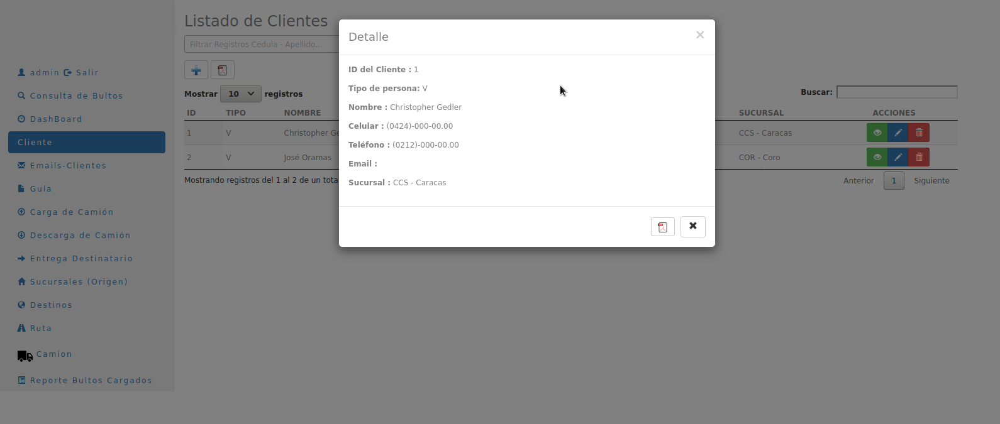

# Barcode
Barcode is a web system that automates and controls the shipping of packages between a company's branches. The system has several modules:

 - A module where customer information is loaded
 - A module where barcode labels that identify packages and packages are printed. These labels are generated in a WORD format and are printed using a Zebra GX420D printer.
 - A module for scanning the barcode that uses a wireless reader, the code when scanned notifies customers by email about the status of their packages.
 - A module where customers can consult online.
 - A module reporting where information can be exported in PDF, WORD and EXCEL formats.

This system was developed with Python-Django, PorstgreSQL was used for data persistence, this was implemented on a Linux web server with Nginx.

# Screenshots

